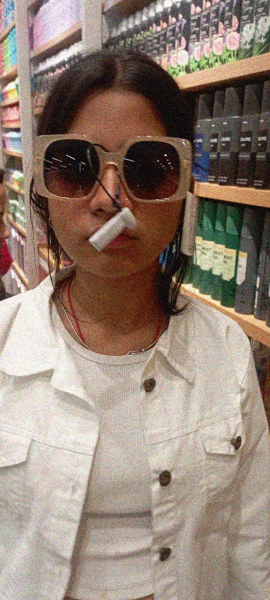
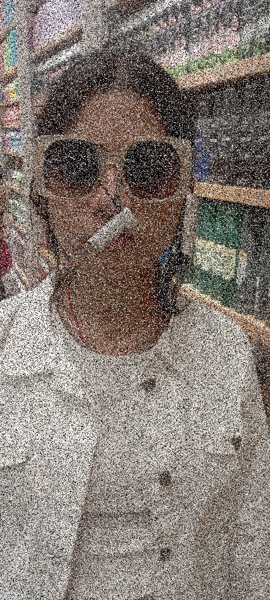

# Image Noise Removal and Denoising Using OpenCV

## Technologies Used

<p align="left">
  
  
  
  
  
</p>

## Abstract

Digital images are often affected by noise during image acquisition, transmission, storage, or processing. Different types of noise require different filtering techniques for effective removal.

This project investigates two common types of image noise:

1. Gaussian noise
2. Salt-and-pepper noise

Gaussian noise is artificially added to a clean image using a normal probability distribution. Salt-and-pepper noise is introduced by randomly replacing image pixels with black and white values.

Two spatial filtering techniques are then applied:

- Gaussian filtering for Gaussian noise
- Median filtering for salt-and-pepper noise

The quality of the denoised images is evaluated quantitatively using Mean Squared Error (MSE) and Peak Signal-to-Noise Ratio (PSNR).

The experiment demonstrates how the choice of denoising technique affects the reconstruction quality of an image.

---
# Visual Results

The following images show the complete denoising process, starting from the original image, adding noise, and then removing the noise using the corresponding filtering technique.

## Gaussian Noise

| Original Image | Gaussian Noisy Image | Gaussian Denoised Image |
|:---:|:---:|:---:|
|  |  |  |
| Original | Gaussian Noise | Gaussian Filter |

The Gaussian noisy image is generated by adding normally distributed noise with:

$$
\mu = 0,\qquad \sigma = 25
$$

The noisy image is then processed using a $5\times5$ Gaussian filter.

---

## Salt-and-Pepper Noise

| Original Image | Salt-and-Pepper Noisy Image | Salt-and-Pepper Denoised Image |
|:---:|:---:|:---:|
|  |  |  |
| Original | Salt & Pepper Noise | Median Filter |

The Salt-and-Pepper noisy image is generated by randomly replacing pixels with:

$$
0 = \text{Pepper}
$$

$$
255 = \text{Salt}
$$

The noisy image is then processed using a $5\times5$ median filter.

---

# 1. Objective

The objectives of this project are:

- To understand the effect of noise on digital images.
- To generate Gaussian noise programmatically.
- To generate salt-and-pepper noise programmatically.
- To study spatial image filtering techniques.
- To remove Gaussian noise using Gaussian filtering.
- To remove salt-and-pepper noise using median filtering.
- To compare the restored images with the original image.
- To evaluate denoising performance using MSE and PSNR.

---

## 2. Image Representation

A digital image can be represented as a matrix of pixel values.

For a grayscale image, the image can be represented as:

$$
I =
\begin{bmatrix}
I(0,0) & I(0,1) & \cdots & I(0,N-1) \\
I(1,0) & I(1,1) & \cdots & I(1,N-1) \\
\vdots & \vdots & \ddots & \vdots \\
I(M-1,0) & I(M-1,1) & \cdots & I(M-1,N-1)
\end{bmatrix}
$$

where:

- $M$ = image height
- $N$ = image width
- $I(x,y)$ = pixel intensity at position $(x,y)$

For an 8-bit grayscale image:

$$
0 \leq I(x,y) \leq 255
$$

where:

- $0$ represents black
- $255$ represents white

For a color RGB image, each pixel contains three values:

$$
I(x,y) = [R(x,y),G(x,y),B(x,y)]
$$

Therefore, a color image can be represented as a three-dimensional array:

$$
I \in \mathbb{R}^{M \times N \times 3}
$$

## 3. Gaussian Noise

Gaussian noise is random noise whose values follow a normal (Gaussian) probability distribution.

The probability density function of a Gaussian distribution is:

$$
p(n) =
\frac{1}{\sqrt{2\pi\sigma^2}}
e^{-\frac{(n-\mu)^2}{2\sigma^2}}
$$

where:

- $\mu$ = mean of the noise
- $\sigma$ = standard deviation
- $\sigma^2$ = variance

The noisy image can be modeled as:

$$
I_n(x,y) = I(x,y) + N(x,y)
$$

where:

- $I(x,y)$ = original image
- $N(x,y)$ = Gaussian noise
- $I_n(x,y)$ = noisy image

For this experiment, the Gaussian noise parameters are:

$$
\mu = 0
$$

$$
\sigma = 25
$$

The noise is generated using NumPy:

```python
noise = np.random.normal(
    mean,
    sigma,
    original_rgb.shape
)
